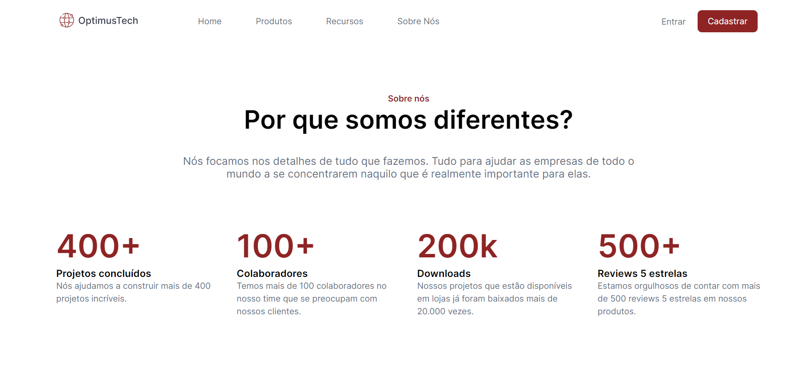
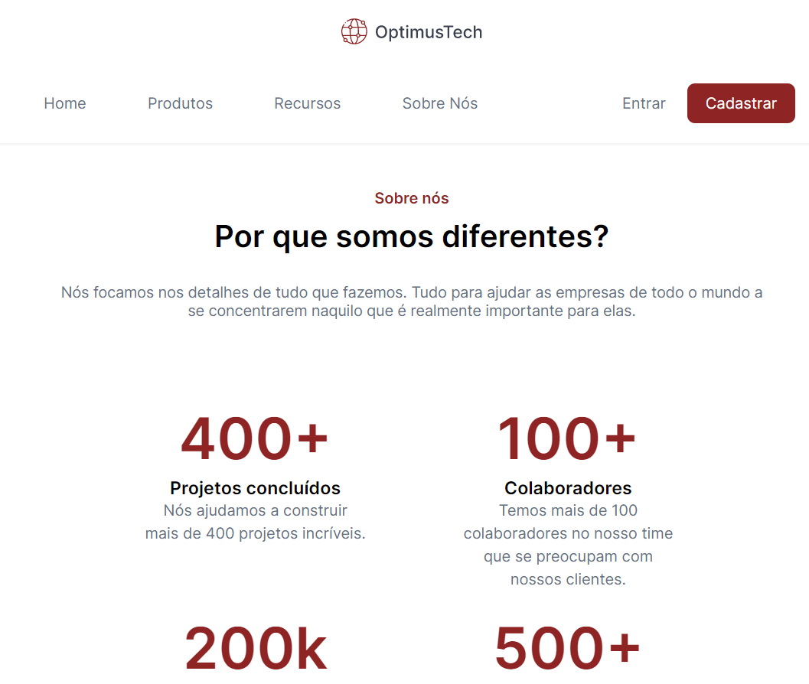
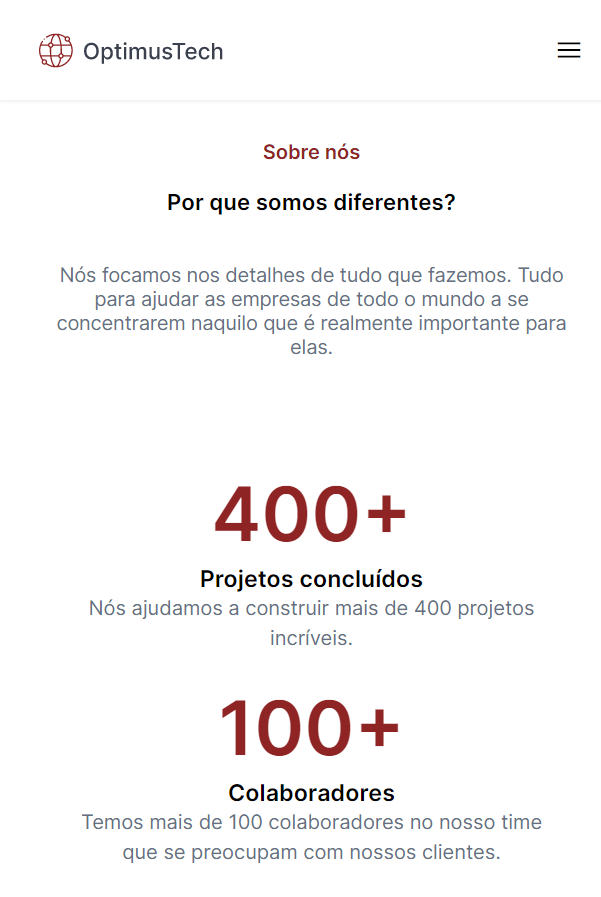
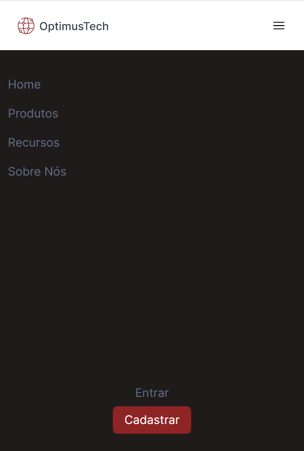

# Desafio HTML & CSS: 7daysOfCode 

Projeto front-end responsivo

> Desktop Tablet e Celular

 

### 🖥️ Versão desktop

### 📔 Versão Tablet:

### 📱 Versão Mobile:

### Menu Lateral

### 📦 Deploy na Vercel

https://optimus-tech-xi.vercel.app/
